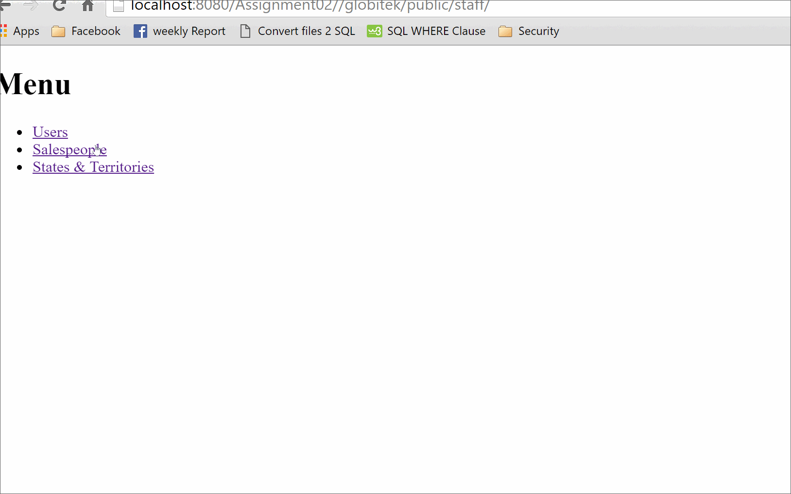

# Project 2 - Globitek Input/Output Sanitization

Time spent: **36** hours spent in total

## User Stories

The following **required** functionality is completed:

- [ ] 1. Import the Starting Database
- [ ] 2. Set Up the Starting Code
- [ ] 3. Staff CMS for Users
- [ ] 4. Staff CMS for Salespeople
- [ ] 5. Staff CMS for States
- [ ] 6. Staff CMS for Territories
- [ ] 7. Validations
- [ ] 8. Sanitization
- [ ] 9. Penetration Testing

## Video Walkthrough

Here's a walkthrough of implemented user stories:

GIF created with [LiceCap](http://www.cockos.com/licecap/).

## Notes

The most difficult part of this assingmnet was completing tasks 6, 7, 8, and 9. 

## License

    Copyright [2016] [Tiffany Benjamin]

    Licensed under the Apache License, Version 2.0 (the "License");
    you may not use this file except in compliance with the License.
    You may obtain a copy of the License at

        http://www.apache.org/licenses/LICENSE-2.0

    Unless required by applicable law or agreed to in writing, software
    distributed under the License is distributed on an "AS IS" BASIS,
    WITHOUT WARRANTIES OR CONDITIONS OF ANY KIND, either express or implied.
    See the License for the specific language governing permissions and
    limitations under the License.
